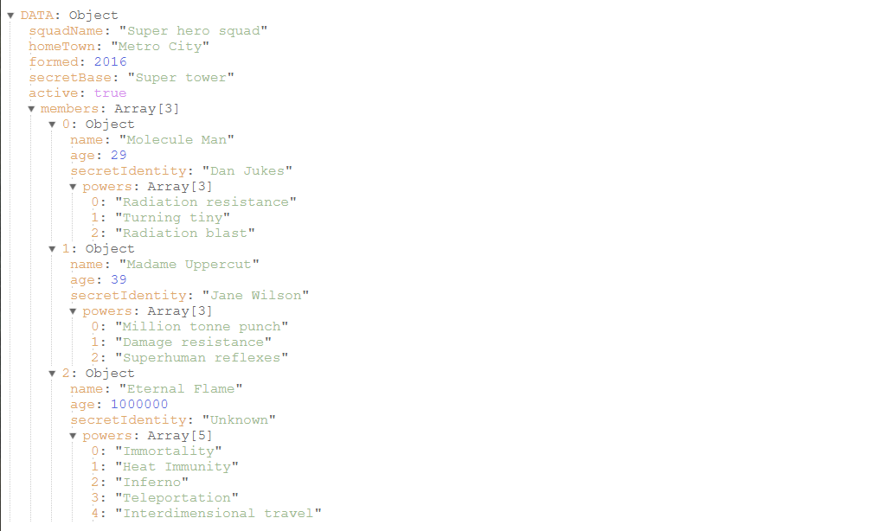

# React JSON Print

Pretty prints JSON object in a collapsible tree view. A Vue.js verion is available [here](https://www.npmjs.com/package/vue-json-print)

Demo: https://tanmancan.github.io/examples/react-json-print/


*example JSON from: https://developer.mozilla.org/en-US/docs/Learn/JavaScript/Objects/JSON*

## Install

```bash
npm install react-json-print
```

## Usage

This package provides a react component to be used in your existing app. The component is compiled, targeting `es2018`, but you may also use the Typescript version.

```jsx
import ReactJsonPrint from 'react-json-print'

const App = () => <ReactJsonPrint dataObject={{}} />
```

### Use the Typescript version
```jsx
import ReactJsonPrint from 'react-json-print/src/react-json-print';

const App = () => <ReactJsonPrint dataObject={{}} />
```

## Props

### `dataObject`
#### type: (`string`|`number`|`boolean`|`null`|`object`|`array`)
#### default: `null`

The data to be printed. Can be primitives, objects, or arrays. All values must be valid JSON types and all object keys must be valid JSON type. (ie. `string` not `Symbol`);

```jsx
const myDataObject = {
  one: 1,
  two: 2,
  array: [
    true,
    false,
    'string',
  ],
};

const App = () => <ReactJsonPrint dataObject={myDataObject} />
```

### `dataString`
#### type: (`string`)
#### default: (`undefined`)

The data to be printed, provided as a valid JSON string. The string will be parsed via `JSON.parse`. If both `dataString` and `dataObject` are provided, the `dataObject` value will be used.

```jsx
const myDataString = '{"one":1, "two":2, "array":[true, false, "string"]}';

const App = () => <ReactJsonPrint dataString={myDataString} />
```

### `expanded`
#### type: (`boolean`)
#### default: `false`

Displays the entire tree in an expanded state. By default all nested nodes in the tree are collapsed.

```jsx
const myDataObject = {
  ...
};

const App = () => <ReactJsonPrint expanded dataObject={myDataObject} />
```

### `depth`
#### type: (`number`)
#### default: `0`

Limits how many levels deep to display child nodes. Value of `0` will print all child nodes. Useful for deeply nested data, when you want to limit the number of node displayed.

```jsx
const myDataObject = {
  ...
};

const App = () => <ReactJsonPrint depth={2} dataObject={myDataObject} />
```

&copy; Tanveer Karim
